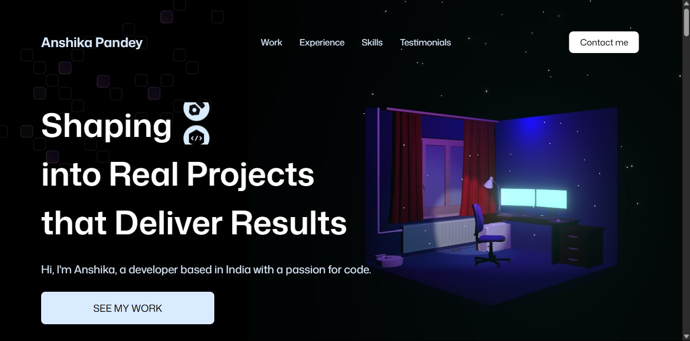

# 🌟 Interactive 3D Portfolio – Anshika Pandey

<p align="center">
  
</p>


🚀 A **modern, interactive, and immersive** personal portfolio built with **React, Vite, Three.js, GSAP, and Tailwind CSS**.  
Crafted to showcase my **skills, projects, and experience** with smooth animations and 3D visuals.

---

<h1 align="center"> 
<a href="http://portfolio-gamma-swart-35.vercel.app"><strong> ➥ Live Portfolio 🏕</strong></a>
</h1>

---

## ✨ Features
- 🎨 Sleek & modern design with smooth animations
- 🖼 Interactive 3D models powered by **Three.js**
- ⚡ Lightning-fast performance with **Vite**
- 📱 Fully responsive for mobile & desktop
- 🛠 Clean, maintainable codebase with reusable components

---

## 💻 Tech Stack
| Technology        | Description |
|-------------------|-------------|
| **React.js**      | Frontend library for building UI |
| **Vite**          | Fast build tool |
| **Three.js**      | 3D rendering engine |
| **GSAP**          | High-performance animations |
| **Tailwind CSS**  | Utility-first CSS styling |
| **Vercel**        | Hosting and deployment |

---

## 📦 Installation & Setup

### 1️⃣ Clone the repository
**Windows 🖥️**
```bash
git clone https://github.com/anshikaPandey11/Portfolio.git
cd Portfolio
```
**Linux / macOS 🍏**
```bash
git clone https://github.com/anshikaPandey11/Portfolio.git
cd Portfolio
```
**2️⃣ Install dependencies**
```bash
npm install
```
**3️⃣ Start the development server**
```bash
npm run dev
```

## 📁 Folder Structure

```
📦 PORTFOLIO/
│
├── 🗂️ public/                     
│   ├── 🖼 images/                  
│   └── 📦 models/                  
│
├── 🗂️ src/                        
│   │
│   ├── 🗂️ components/              
│   │   ├── 🗂 HeroModels/           
│   │   │   ├── 📑 HeroExperience.jsx
│   │   │   ├── 📑 HeroLights.jsx
│   │   │   ├── 📑 Particles.jsx
│   │   │   └── 📑 Room.jsx
│   │   │
│   │   ├── 🗂 Models/               
│   │   │   ├── 🗂 contact/
│   │   │   │   ├── 📑 Computer.jsx
│   │   │   │   └── 📑 ContactExperience.jsx
│   │   │   └── 🗂 TechLogos/
│   │   │       └── 📑 TechLogos.jsx
│   │   │
│   │   ├── 📑 AnimatedCounter.jsx
│   │   ├── 📑 Button.jsx
│   │   ├── 📑 GlowCard.jsx
│   │   ├── 📑 NavBar.jsx
│   │   └── 📑 TitleHeader.jsx
│   │
│   ├── 🗂 constants/               
│   │   └── 📑 index.js
│   │
│   ├── 🗂 sections/                
│   │   ├── 📑 Contact.jsx
│   │   ├── 📑 ExperienceSection.jsx
│   │   ├── 📑 FeatureCards.jsx
│   │   ├── 📑 Footer.jsx
│   │   ├── 📑 Hero.jsx
│   │   ├── 📑 LogoSection.jsx
│   │   ├── 📑 ShowcaseSection.jsx
│   │   ├── 📑 TechStack.jsx
│   │   └── 📑 Testimonials.jsx
│   │
│   ├── 📑 App.jsx
│   ├── 📑 index.css
│   ├── 📑 main.jsx
│   │
│   └── 📑 index.html
│
├── 📑 .env
├── 📑 .gitignore
├── 📑 eslint.config.js
├── 📑 package.json
├── 📑 package-lock.json
├── 📑 vite.config.js
└── 📑 README.md
```

📬 Contact :- </br>
💼 LinkedIn: https://www.linkedin.com/in/anshika-pandey-522760289
</br>

⭐ If you like this portfolio, consider giving the repository a star!


